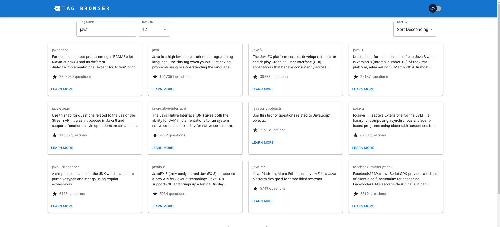

# Stack Overflow Tag Browser

The application is a tag search engine provided by the [StackOverflow API](https://api.stackexchange.com/docs). It allows users to browse tags, sort them by various criteria and display the number of related questions. It is hosted using [Netlify](https://stack-overflow-tag-browser-jr.netlify.app/).


## Features

- A paged table or list of tags:
    - Tags are displayed in a paginated table or list.


- Number of related posts:
    - For each tag, the number of questions to which it is related is displayed.


- Configurable number of items per page:
    - The user can choose how many tags to display per page.


- Choice of sorting field and direction:
    - The user can sort tags by tag name and number of related questions


- Data loading and error states:
    - The application displays appropriate messages when loading data or when errors occur.


- Use of UI component library:
    - The application uses the [MUI](https://mui.com/) library to create the user interface.
- Use of libraries for state management and data retrieval:
    - The application uses the [jotai](https://jotai.org/) library for state management
- Storybook:
    - The application includes a [Storybook](https://storybook.js.org/) to present the components used.

## Tech Stack

**React:** A JavaScript framework for creating user interfaces

**MUI:** UI component library for React

**jotai:** A library for state management

**Storybook:** A tool for presenting React components.

**Netlify:** Deployment and hosting automation platform


## Installation

1. Clone the GitHub repository:

```bash
  git clone https://github.com/joohnnyvv/stackoverflow-tag-browser.git
```

2. Install dependencies:
```bash
  npm ci
```

3. Launch the application:
```bash
  npm start
```

4. Open Storybook:
```bash
  npm run storybook
```
    
